<link rel="stylesheet" type="text/css" media="all" href="Repetitionsfragen.css" />

# Table of Contents

1.  [Repetitionsfragen Teil Leuenberger](#org9f14304)
    1.  [Woche 1](#org72b36fa)
        1.  [Was ist der Unterschied zwischen funktionalen-und nichtfunktionalen Anforderungen?](#orgf762acb)
        2.  [Was ist ein Requirement genau?](#org52eea7b)
        3.  [Definieren Sie den Requirement Engineer (RE) / Business Analyst(BA)](#orgd8530d6)
        4.  [Was sind die 4 Kernpunkte/Aktivitäten im RE?](#org501ce41)
        5.  [Nennen Sie mindestens 4 Methoden um Requirements zu finden](#org0424a88)
        6.  [Wie können Requirements definiert und beschreiben werden?](#org3a10951)
        7.  [Formulieren Sie 3 offene und 3 geschlossene Fragen](#org5b0910e)
        8.  [Was ist ein Stakeholder (Definitionund mögliche Beispiele)](#org5bf3345)
        9.  [Warum ist ein Programmierer ggf. nicht geeignet für Security RE?](#org04ef143)
        10. [Was sind die Gefahren, wenn man RE nicht korrekt einplant und durchführt?](#orgac2c78f)
        11. [Was kann man tun / vorgehen, wenn man unter Zeitdruck steht beim RE?](#org0b02988)
        12. [Zeigen Sie ein System mit Systemgrenzen und Kontext auf](#org3fea225)
    2.  [Woche 2](#org0f6c83f)
        1.  [Nennen Sie die 3 Perspektiven in/von welchen man Requirements betrachten kann](#org3f4a6f4)
        2.  [Wie kann man Requirements Beschreiben bzw. Dokumentieren?](#org32833df)
        3.  [Nennen Sie die Elemente eines Datenflow Diagramms (DFD)](#orgb04c33b)
        4.  [Nennen Sie einige Qualitätskriterien von Requirements](#org7cc7b4c)
        5.  [Warum ist ein Glossar wichtig?](#orgf8fc46c)
        6.  [Was gibt es für Standards zur Dokumentation von Requirements, nennen Sie 3](#org57db4ef)
        7.  [Was ist der Unterschied zwischen Security & Safety?](#orge9a7fc0)
        8.  [Was versteht man unter «Defense in depth» Ansatz?](#orgc5d6278)
        9.  [Was versteht man unter Perimeter Sicherheit?](#org957ed74)
        10. [Warum ist Perimeter Sicherheit nicht mehr unbedingt das Grundkonzept für die Sicherheit von Modernen Systemen/IT-Landschaften und was sind die aktuellen Challenges?](#org4f4caf3)
        11. [Was ist eine Vulnerability?](#org18abae2)
        12. [Was ist ein Exploit?](#orgafcd007)
        13. [Wie wird eine Vulnerability ausgenützt, beschreiben Sie das Vorgehen](#org8fd5581)
        14. [Was ist Malware und wie läuft eine Infektion ab?](#orgae09fae)
    3.  [Woche 3](#orgc0c8dc9)
        1.  [Wie ist das Verhältnis von Kosten und Bugs bzw. Zeitpunkt deren Erkennung im Projekt. Wie können Sie dies nutzen für die Argumentation von Security Requirement Engineering im Projekt?](#org32fb4e2)
        2.  [Was ist ein SW Bug?](#org30fc802)
        3.  [Warum macht man Threat modeling?](#org104190b)
        4.  [Was gibt es für rechtliche Anforderungen, die man ggf. beachten sollte?](#org006f9c1)
        5.  [Was ist der Vorteil und Nachteil von einem Wasserfall Model?](#org46a29a7)
        6.  [Machen Sie ein Beispiel in einer Tabelle für eine Vulnerability und deren Auswirkung analog unserem Bsp. im Unterricht (Vulnerability, Threat, Threat Action, Risk)](#org028a54c)
        7.  [Was sind mögliche Quellen von Bugs?](#org6051f5a)
        8.  [Was sind die verschiedenen Activities in einem SW Prozess, nennen Sie diese](#org6d298be)
        9.  [Was ist ein Prozess Model? Nennen Sie 4 Beispiele](#orge2fe9ad)
        10. [Nenne Sie Qualität Attribute in der Software quality assurance](#orgefa40a4)
        11. [Was ist das agile Manifest, was wird darin festgehalten?](#orgc430d0c)
        12. [Was ist DevOps und was für einen Impact hat dies auf das Security Requirement Engineering?](#orgbd2f51b)
        13. [Was sind die Grundschritte beim SDLC, in welche Schritte beim SDLC kann man Security integrieren?](#org1a8f2f8)
        14. [Was gibt es für Standard Kataloge bzgl. Security Requirements](#org228d383)
        15. [Was ist OWASP, wie kann man OWASP für Security Requirement engineering nutzen?](#orgdb26834)
        16. [Was ist ein Threat? Was ist eine Vulnerability? Was ist der Unterschied?](#org496f69a)
        17. [Was sind die Schritte beim Threat Modeling?](#org0e9e00a)
        18. [Nennen Sie Beispiele für SW Qualitlt](#org694d22c)
        19. [Machen Sie ein korrektes Beispiel eines DFDs inklusive Legende](#org99b20b1)
        20. [Was ist der Vorteil und Nachteil von einem Agilen Model? Was ist das Kernkonzept der agilen Vorgehensweise?](#orgc842bda)
    4.  [Woche 4](#org51e302d)
        1.  [Nennen Sie für jeden Threat im STRIDE Model eine Mitigation Massnahme](#orgf8feef6)
        2.  [Wie können AI und ML Threats und das Verhalten von Angreiffern beeinflussen?](#orge4ef435)
        3.  [Was bedeutet STRIDE?](#org44308e5)
        4.  [Was bedeutet DREAD](#org009c50d)
        5.  [Was gibt es für Modelle, um das Riskrating vorzunehmen mit DREAD?](#org6e52113)
        6.  [Was für mögliche Rahmenwerke können Ihnen helfen, um Threats zu identifizieren?](#org9d826d6)
        7.  [Was ist unter Mitigation zu verstehen?](#org32d0f3b)
        8.  [Was ist in der heutigen Zeit (Entwicklung der aktuellen IT-Landschaft) die Herausforderung mit STRIDE?](#org1924b8c)
        9.  [Beschreiben Sie die 4 Schritte des Threat Modeling Prozesses](#orgf785c28)
2.  [Teil Varga (English)](#orgeef0328)
    1.  [OWASP Top 10](#orgaef1123)
        1.  [Injections](#org95a791d)
        2.  [Broken Authentication](#orgcc68b76)
        3.  [Sensitive Data Exposure](#org2282d96)
        4.  [XML External Entities](#org43e43b8)
        5.  [Access Control](#orgdb36d36)
        6.  [CSRF](#orgc0200e5)
        7.  [XSS](#orgebe8ce8)
        8.  [Insecure Deserialisation](#org8dd0dda)
        9.  [Using Components With Known Vulnerabilities](#orge4ad157)
    2.  [Authentication/Authorisation](#org5927f96)
        1.  [SAML](#org4c4ff4f)
        2.  [Security Tokens](#orgc96441c)
        3.  [OAuth](#org9d7ba7e)
    3.  [Untrusted Input](#org74c358e)
        1.  [Validation](#org6f07199)
        2.  [Encoding/Escaping/Sanitisation](#org4d16f81)
    4.  [Security Principles](#org3d7f0d9)
        1.  [Minimum Exposure](#orgb0d4001)
        2.  [Simplicity](#org870503b)
        3.  [Defense in depth](#orgfa9604e)
        4.  [Least privilege](#org4ba22c7)
        5.  [Compartmentalisation](#orgb587e7d)
        6.  [Minimum trust and maximum trustworthiness](#orgde8a8df)
        7.  [Traceability and mediation](#org189998e)
    5.  [Security through Typing](#orgac04fc2)
        1.  [Classification of Typing](#org8c564f7)
        2.  [Typing and Security](#orgf2184f3)
    6.  [OWASP and STRIDE](#org24730eb)


<a id="org9f14304"></a>

# Repetitionsfragen Teil Leuenberger


<a id="org72b36fa"></a>

## Woche 1


<a id="orgf762acb"></a>

### Was ist der Unterschied zwischen funktionalen-und nichtfunktionalen Anforderungen?

#### 3 Beispiele für funktionale Anforderungen

-   Die Maschine muss Kaffee rauslassen können
-   Der Kaffee muss mit Bargeld oder Karte bezahlt werden können
-   Es muss ein Nachfüllmechanismus vorhanden sein

#### 3 Beispiele für nichtfunktionale Anforderungen

-   Es müssen mehrere Arten von Kaffee zur Verfügung stehen
-   Das UI muss ein touchscreen sein
-   Es müssen 10'000 Kaffees rausgelassen werden können bevor die Maschine nachgefüllt werden muss


<a id="org52eea7b"></a>

### Was ist ein Requirement genau?

Eine Bedingung oder Fähigkeit des Produktes, die ein user benötigt, zu, ein gestelltes Problem zu lösen


<a id="orgd8530d6"></a>

### Definieren Sie den Requirement Engineer (RE) / Business Analyst(BA)

#### Was ist die Rolle eines RE in einem Projekt?

Der RE ist die Schnittstelle zwischen der technischen Seite des Projektes (den Programmierern) und dem Management. Er kann zwischen diesen beiden Seiten 'übersetzen'

#### In welchen Phasen ist der RE involviert?

In allen Phasen

1.  Requirement Analyse

    -   Stakeholder-Analyse
    -   DokumentenAnalyse
    -   Erhebung der Anforderungen
    -   Workshops / Interviews mit Stakeholder
    -   Business und User-Requirement Analyse
    -   Auflistung und Priorisierung der Use-Cases

2.  Design

    -   Detaillierte Spezifikationen von Business-Problemen, Aktoren, Use-Cases und Interfaces
    -   GUI Design
    -   Review der Spezifikationen
    -   Abnahme der Spezifikationen

3.  Implementation

    -   Walkthrough der Spezifikationen mit Technical Project Lead (TPL) und Devs
    -   Support der Devs
    -   Klärung von allfälligen neuen Punkten mit den Business Stakeholdern
    -   Change Management

4.  Testing

    -   Test Support
    -   Klärung von allfälligen Defekten
    -   Klärungen von allfälligen neuen Issues
    -   Change Management

5.  Evolution

    -   Analyse der Change Requests
    -   "Aufräumen" der Dokumentation


<a id="org501ce41"></a>

### Was sind die 4 Kernpunkte/Aktivitäten im RE?

1.  Elicitation

    Während der Erhebung der Requirements werden verschiedene Techniken verwenden, um Requirements von Stakeholdern (und allfälligen anderen Quellen) zu erhalten und zu verbessern

2.  Documentation

    In der Dokumentationsphase werden die erhobenen Requirements genauer beschrieben. Auch hier werden verschiedene Technologien verwendet.

3.  Validation and Negotiation

    Um sicherzustellen, dass die erhobenen Requirements den Ansprüchen der Stakeholder genügen, müssen sie schon früh validiert und allenfalls tiefer verhandelt werden

4.  Management

    Requirement Management wird in allen bisher genannten Aktivitäten benötigt und beinhaltet alle benötigten Massnahmen um die erhobenen Requirements zu strukturieren. Das heisst, sie so zu verarbeiten,
    dass die Devs ein Produkt/eine Software danach entwickeln können, das Management sie aber trotzdem noch versteht. Ebenfalls muss eine Konsistenz geschaffen werden.


<a id="org0424a88"></a>

### Nennen Sie mindestens 4 Methoden um Requirements zu finden

-   Dokumentations-Analyse
-   Interviews mit Stakeholdern
-   Workshops
-   Questionnaires
-   Brainstorming

#### Welche davon sind Kreativ Methoden?

Kreativ-Methoden dienen dazu, ****innovative**** Requirements zu finden.


<a id="org3a10951"></a>

### Wie können Requirements definiert und beschreiben werden?

#### Beispiele für ein statisches und agiles Vorgehen?

**Statisch**

Wasserfall-Modell

-   Alle Requirements werden bereits zu Beginn erhoben, verfeinert und dokumentiert und sollten sich im Verlauf des Projektes möglichst nicht ändern.

**Agil**

SCRUM/Sprint-Basiert:

-   Requirements werden 'on the go' erhoben. Erst bevor sie implementiert werden, werden die Requirements als 'Features' definiert. Dies, da es schwer ist, alle benötigten Funktionalitäten bereits zu Begiunn eines Projektes zu definieren, weil sich während der Laufzeit des Projektes noch viel verändernk kann.


<a id="org5b0910e"></a>

### Formulieren Sie 3 offene und 3 geschlossene Fragen

**Offene Fragen**

-   Wieso bist du hier?
-   Was sind deine Hobbies?
-   Welche Security-Lücken müssen geschlossen werden?

**Geschlossene Fragen**

-   Sind die besprochenen Security-Lücken bereits geschlossen worden?
-   Liegen wir noch im Zeitplan?
-   Habt ihr schon mit den Stakeholder gesprochen?


<a id="org5bf3345"></a>

### Was ist ein Stakeholder (Definitionund mögliche Beispiele)

Eine Person, die am Produkt interessiert ist (Entweder Endnutzer oder Distributor oder Hersteller&#x2026;)

#### Zeichnen Sie eine Stakeholderliste anhanden des Kaffeemaschine Cases

-   Kaffee-Hersteller
-   Betreiber von Kaffeemaschinen
-   Universitäts/Hochschulsbetreiber
-   Kaffeetrinker
    


<a id="org04ef143"></a>

### Warum ist ein Programmierer ggf. nicht geeignet für Security RE?

Er hat nicht das nötige Know-How und ggf. auch nicht die Zeit. Zduem ist er 'zu nah' am Produkt (Creator-Blindness)


<a id="orgac2c78f"></a>

### Was sind die Gefahren, wenn man RE nicht korrekt einplant und durchführt?

Es kommt wesentlich teurer, die Fehler bei/nach der Implementierung zu flicken, da viele Dinge voneinander abhängen


<a id="org0b02988"></a>

### Was kann man tun / vorgehen, wenn man unter Zeitdruck steht beim RE?

Risikobasiertes Priorisieren und von oben anfangen (Requirement mit dem höchsten Risiko) und so weit arbeiten wie man kommt


<a id="org3fea225"></a>

### Zeigen Sie ein System mit Systemgrenzen und Kontext auf

\ 


<a id="org0f6c83f"></a>

## Woche 2


<a id="org3f4a6f4"></a>

### Nennen Sie die 3 Perspektiven in/von welchen man Requirements betrachten kann

1.  Datenperspektive

    Welches **Format** bzw. welche **Struktur** haben die **Daten**, die in das **System hereingegeben** werden und welches Format bzw. Struktur haben die **retournierten Daten**?

2.  Funktionale Perspektive

    Welche Informationen (Daten) werden vom System empfangen und von dessen Methoden/Funktionen verarbeitet. Diese Dokumentationsmethode beschreibt ebenfalls, welche Daten wieder zurückgegeben werden. Ebenfalls wichtigt ist es zu dokumentieren, **in welcher Reihenfolge** die Funktionen/Methoden die empfangenen Daten verarbeiten.

3.  Verhaltensperspektive

    Diese Methode beschreibt wie das System mit dem umliegenden **Kontext interagiert**. Das heisst, wie **reagiert** das System auf bestimmte **Events vom umliegenden Kontext** und welche **Konditionen** müssen gegeben sein, dass es so reagiert. Ebenfalls wird dokumentiert, wie das System den umliegenden Kontext beeinflusst (z.B. einen Trigger auslöst, der ein weiteren Prozess in einem anderen System ankickt)
    
    Dies wird meist mittels State-Diagrammen dargestellt.


<a id="org32833df"></a>

### Wie kann man Requirements Beschreiben bzw. Dokumentieren?

1.  Natural Language

    Beschreibt das System in natürlicher Sprache, evtl. mit Templates.
    > Das System **WIRD/MUSS/KANN/SOLLTE** **TASK** tun können
    
    > Das System **<WIRD/MUSS/KANN/SOLLTE>** **<USER/ROLLE>** **<TASK>** ermöglichen 

    \ 

2.  Modelle

    Alternativ können Modelle und Diagramme verwendet werden. Das hat den Vorteil, dass die Requirements klarer dargestellt sind und weniger Raum für Spekulationen bietet. Jedoch muss der Betrachter ein grundsätzliches Verständnis des Modells/Diagramms haben
    
    1.  Usecase Diagramm
    
        Welche Funktionen werden welchem Benutzer/welcher Rolle des Systems zur Verfügung gestellt

        \ 
    
    2.  Klassendiagramm
    
        Gut geeignet, um Datenstrukturen zu dokumentieren. Welche Klassen/Interfaces verlangen welche Datentypen als Input and retournieren welche Datentypen? Ebenfalls zeigt ein solches Diagramm die Zusammenhänge und Abhängigkeiten von Komponenten.
        
        \ 
    
    3.  Aktivitätsdiagramm
    
        Gut geeignet, um Prozessabläufe zu dokumentieren. Welche Tasks werden nacheinander durchgeführt? Welche Bedingungen müssen erfüllt sein?

        \ 
    
    4.  Statusdiagramm
    
        Gut geeignet, um die Verhaltensperspektive zu dokumentieren. Statusdiagramme zeigen die verschiedenen Stati des Systems auf, welche Events einen Statuswechsel auslösen und wie sich diese Stati auf den Systemkontext auswirken

        \ 


<a id="orgb04c33b"></a>

### Nennen Sie die Elemente eines Datenflow Diagramms (DFD)

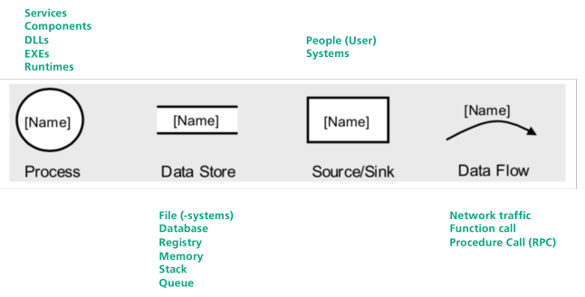\ 


<a id="org7cc7b4c"></a>

### Nennen Sie einige Qualitätskriterien von Requirements

-   Eindeutigkeit, was gmeeint ist
-   Klare Struktur
-   Modifizier- und Erweiterbar
-   Vollständig
-   Nachverfolgbar


<a id="orgf8fc46c"></a>

### Warum ist ein Glossar wichtig?

So dass alle Beteiligten vom Gleichen sprechen, wennsie dasselbe Wort benutzen. 


<a id="org57db4ef"></a>

### Was gibt es für Standards zur Dokumentation von Requirements, nennen Sie 3

-   RUP (Rational Unified Process)
-   V-Model 2004
-   ISO/IEC/IEEE standard 29148:2011


<a id="orge9a7fc0"></a>

### Was ist der Unterschied zwischen Security & Safety?

Security schützt Systeme gegen Angriffe
Safety schützt Mensch und Umwelt gegen Systeme


<a id="orgc5d6278"></a>

### Was versteht man unter «Defense in depth» Ansatz?

Es soll nicht mehr nur der Perimeter geschützt werden, sondern auch im Netzwerk müssen Security-measures deployed werden (z.B. Endpoint Detection and Response)


<a id="org957ed74"></a>

### Was versteht man unter Perimeter Sicherheit?

Es muss sichergestellt werden, dass kein Angreifer von aussen ins Netzwerk kommt. "Grenzwache"


<a id="org4f4caf3"></a>

### Warum ist Perimeter Sicherheit nicht mehr unbedingt das Grundkonzept für die Sicherheit von Modernen Systemen/IT-Landschaften und was sind die aktuellen Challenges?

Die heutige Netzwerkstruktur ist zu komplex, um rein durch Perimeter-Sicherung geschützt werden zu können. Man kann die 'Aussengrenze' eines Netzwerks nicht mehr genau definieren. Wenn nur Perimeter-Security angewendet wird, und der Angreifer kommt trotzdem irgendwie ins Netzwert, ist man am Arsch. Mit in-depth Sicherheit ist er zwar im Netzwerk, aber dank z.B. Netzwerk-Segmentation ist 'nur' ein einzelner Netzwerksektor betroffen, der in Lockdown versetzt werden kann.
Zusem können Attacken heute auch von innen heraus kommen.


<a id="org18abae2"></a>

### Was ist eine Vulnerability?

Ein Programmier- und/oder Designfehler, der zu Security-Bedrohungen/Schaden führen kann.


<a id="orgafcd007"></a>

### Was ist ein Exploit?

Technik zur Ausnutzung einer Vulnerability


<a id="org8fd5581"></a>

### Wie wird eine Vulnerability ausgenützt, beschreiben Sie das Vorgehen

Es wird Programmcode geschrieben, der den Programm- oder Designfehler ausnützt, meist um Schadcode in ein System zu injizieren.


<a id="orgae09fae"></a>

### Was ist Malware und wie läuft eine Infektion ab?

Malware = **Mal** icious **Soft** ware.

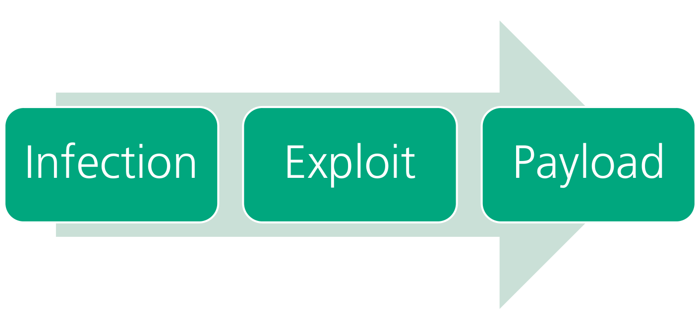\ 

1.  Infect

    Der Attaker versucht irgendwie ins System zu kommen. Dies geschieht z.B. via phishng-mail. Dies installiert meist ein erster Teil der Malware, ein sogenannter "Dropper".

2.  Exploit

    Der Dropper kommuniziert zu einem externen C2 Server (Command and Control), der unter bestimmten Bedingungen weitere Anweisungen gibt und/oder ein weiterer Teil der Malware auf das infizierte System herunterlädt.

3.  Payload

    Die Malware führt nun Schadcode aus, die z.B. Daten exfiltrieren oder verschlüsseln kann.


<a id="orgc0c8dc9"></a>

## Woche 3


<a id="org32fb4e2"></a>

### Wie ist das Verhältnis von Kosten und Bugs bzw. Zeitpunkt deren Erkennung im Projekt. Wie können Sie dies nutzen für die Argumentation von Security Requirement Engineering im Projekt?

Je später der Bug gefunden wird, desto teurer wird es, ihn zu fixen. Denn im Verlauf des Projektes wird die Software immer komplexer mit mehr Abhängigkeiten. 


<a id="org30fc802"></a>

### Was ist ein SW Bug?

Ein Fehler in einem Programm, das dazu führt, dass es sich nicht so verhält wie erwartet und/oder falsche Resultate liefert.


<a id="org104190b"></a>

### Warum macht man Threat modeling?

Um die Netzwerk- und Applikationssicherheit zu verbessern. 
Dies, indem man kritische Assets identifiziert, mögliche Attacken auf diese Assets analysiert und basierend darauf Gegenmassnahmen plant und einleitet, die diese Attacken verunmöglichen oder zumindest das Rikio abschwächen.


<a id="org006f9c1"></a>

### Was gibt es für rechtliche Anforderungen, die man ggf. beachten sollte?

In gewissen Branchen muss man compliant zu gewissen Regulationen sein (HIPAA, PCI-DSS etc.)


<a id="org46a29a7"></a>

### Was ist der Vorteil und Nachteil von einem Wasserfall Model?

1.  Vorteile

    -   Einfaches Projektmanagement
    -   Lineare Vorgehensweise
    -   Einfache Definition von Meilensteinen

2.  Nachteile

    -   Programmierer sind recht eingeschränkt
    -   Ist sehr starr und reagiert nicht auf allfällige Änderungen während des Projekts


<a id="org028a54c"></a>

### Machen Sie ein Beispiel in einer Tabelle für eine Vulnerability und deren Auswirkung analog unserem Bsp. im Unterricht (Vulnerability, Threat, Threat Action, Risk)

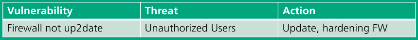\ 


<a id="org6051f5a"></a>

### Was sind mögliche Quellen von Bugs?

-   Kommunikationsfehler
-   Unklare Requirements
-   Programmierfehler
-   (Selbstauferlegter) Druck
-   Zu komplexe Software
-   Ständig wechselnde Requirements
-   Schlecht oder gar nicht dokumentierter Code
-   Keine Tester


<a id="org6d298be"></a>

### Was sind die verschiedenen Activities in einem SW Prozess, nennen Sie diese

-   **Software-Spezifikation:** Die Hauptfunktionalitäten und Requirements der Software müssen bestimmt werden
-   **Software Design und Implementation:** Die Software wird um diese Requirements herum designed und implementiert
-   **Software Verifikation und Validierung:** Es muss überprüft werden, dass die Software diese Requirements auch tatsächlich erfüllt
-   **Software Evolution/Maintenance:** Die Software muss gewartet und je nach den Kundenwünschen angepasst werden.


<a id="orge2fe9ad"></a>

### Was ist ein Prozess Model? Nennen Sie 4 Beispiele

Das Prozess Modell ist ein Startpunkt für die Projektplanung und -management. 

-   Wasserfall
    - Das Projekt wird phasenweise abgearbeitet, mit Meilenstein-Releases

-   Prototyping

    - Ein iterativer Prozess. In jeder Iteration wird dem Kunden ein Prototyp vorgestellt. Falls der dem Kunden gefällt, wird er weiterentwickelt.

-   RUP (Rational Unified Process)

    - Zuerst wird eine Vision/ein Anwendungsfall ausformuliert (Inceptin). Dieser wird anschliessend weiter ausgearbeitet (Elaboration) und schlussendlich Implementiert (Construction). Das Resultat wird dem Kunden als "Release Milestone" übergeben (Transition(. Der Prozess beginnt anschliessend wieder von vorn 

-   Agil

    -  Ähnlich wie RUP. Jedoch meist zeitbasiert anstelle von funktionsbasiert. Es wird eine Zeitspanne für einen 'Sprint' festgelegt und was in diesem Sprint implementiert werden soll. Nach diese Zeitraum wird dem Kunden die implementierte (Teil-)Software übergeben und es beginnt ein enuer Sprint.


<a id="orgefa40a4"></a>

### Nenne Sie Qualität Attribute in der Software quality assurance

-   Funktionalität
    - Tauglichkeit
    - Akkuratheit
    - Interoperabilität
    - Compliance
    - Sicherheit

-   Zuverlässigkeit
    - Maturität
    - Wiederherstellbarkeit

-   Usability
    - Verständlichkeit
    - Lernbarkeit

-   Effizienz
    - Zeitaufwand
    - Verhalten
    - Ressourcennutzung

-   Wartbarkeit
    - Analysierbarkeit
    - Veränderbarkeit
    - Stabilität
    - Testbarkeit

-   Portabilität
    - Adaptierbarkeit
    - Installierbarkeit
    - Konformität
    - Ersetzbarkeit


<a id="orgc430d0c"></a>

### Was ist das agile Manifest, was wird darin festgehalten?

Prinzipien, wie man agile Software entwickeln sollte. Prinzipiell basiert es auf vier Grundsätzen:

-   Individuen und Interaktionen mehr als Prozesse und Werkzeuge
-   Funktionierende Software mehr als umfassende Dokumentation
-   Zusammenarbeit mit dem Kunden mehr als Vertragsverhandlung
-   Reagieren auf Veränderung mehr als das Befolgen eines Plans


<a id="orgbd2f51b"></a>

### Was ist DevOps und was für einen Impact hat dies auf das Security Requirement Engineering?

DevOps steht für Developer Operation und beschreibt die Zusammenarbeit der Devs und Operation (IT-Betrieb). 
Durch gemeinsame Prozesse, Anreize und Tools soll die Zusammenarbeit dieser zwei Departements verbessert werden. Dies vereinfacht auch die Übergabe der fertigen Software vom Development zum Betrieb.

Wenn Development und Operations beide dieselben Security Prinzipien haben, wird es mehr und konsequenter durchgesetzt und verbessert so die allgemeine Sicherheit der Software


<a id="org1a8f2f8"></a>

### Was sind die Grundschritte beim SDLC, in welche Schritte beim SDLC kann man Security integrieren?

-   Training
    - Sicherheits-Know-How im Unternehmen bestimmen. Je nach dem Training anbieten

-   Requirements
    - Security-Requirements identifizieren und gewichten

-   Design
    - Security by Design
    - Security Architektur definieren und dokumentieren
    - Security Critical Komponenten identifizieren

-   Implementation
    - Review, um Prozesse, Dokumentationen und Tools zu identifizieren, die für eine sichere Entwicklung benötigt werden

-   Verifikation
    - Security-Response planning - Was tun wenn ein Vulnerability Report kommt?

-   Release
    - Suppoirt-policy klar definieren
    - Letzte Überprüfung auf allfällige Security Vulnerabilities

-   Response
    - Bei Bedarf den definierten Security-Response Plan durcharbeiten


<a id="org228d383"></a>

### Was gibt es für Standard Kataloge bzgl. Security Requirements

-   Rational Unified Process (RUP)
-   ISO/IEC/IEEE standard 29148:211
-   V-Model


<a id="orgdb26834"></a>

### Was ist OWASP, wie kann man OWASP für Security Requirement engineering nutzen?

[OWASP](https://owasp.org) = Open Web Application Security Project. 

OWASP ist eine non-profit Organisation, die sich das sichere Entwickeln von (Web)Applikationen zum Ziel gesetzt hat. Sie veröffentlicht regelmässig Guides und defacto Standards zur freien Verfügung.


<a id="org496f69a"></a>

### Was ist ein Threat? Was ist eine Vulnerability? Was ist der Unterschied?

####  Vulnerability

Eine Schwachstelle in einem Programm/Protokoll, die ausgenutzt werden kann z.b. um unauthorisierten Zugriff auf ein Asset zu erhalten

####  Threat

Eine mögliche böswillige Ausnutzung dieser Schwachstelle

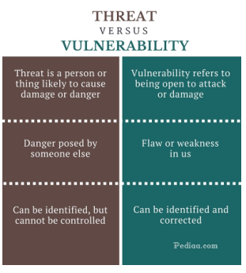\ 

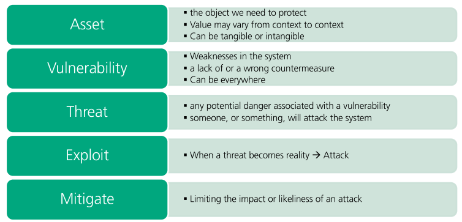\ 


<a id="org0e9e00a"></a>

### Was sind die Schritte beim Threat Modeling?

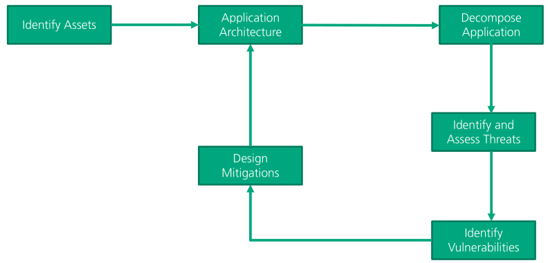\ 

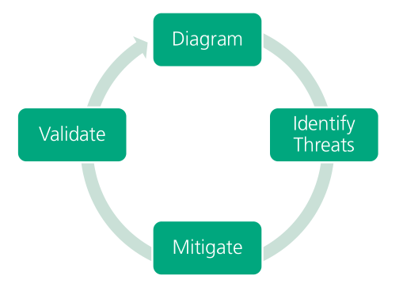\ 


<a id="org694d22c"></a>

### Nennen Sie Beispiele für SW Qualitlt

-   Software hat alle Features, die für das Erfüllen der Requirements benötigt werden
-   Software hat Security- und Safety-Requirments erfüllt


<a id="org99b20b1"></a>

### Machen Sie ein korrektes Beispiel eines DFDs inklusive Legende

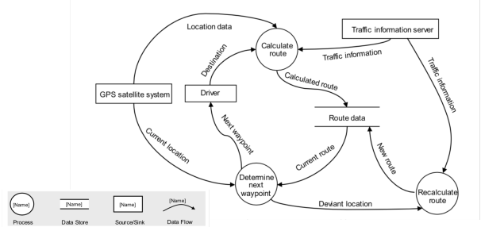\ 


<a id="orgc842bda"></a>

### Was ist der Vorteil und Nachteil von einem Agilen Model? Was ist das Kernkonzept der agilen Vorgehensweise?

#### Kernkonzept

-   Wiederverwendung von Ressourcen
-   KISS (Keep It Small and Simple / Keep It Simple Stupid)
-   Der Code 'gehört' dem ganzen Team
-   Funktionelles und Kundenorientiertes Programmieren

#### Vorteile

-   Wenige Regeln, leicht verständlich und schnell einführbar
-   Kurze Kommunikationswege
-   Hohe Flexibilität/Agilität durch adaptives Planen
-   Hohe Effektivität durch Selbstorganisation
-   Hohe Transparenz durch regelmäßige Meetings und Backlogs
-   Zeitnahe Realisation neuer Produkteigenschaften bzw. Inkremente
-   Kontinuierlicher Verbesserungsprozess
-   Kurzfristige Problem-Identifikation
-   Geringer Administrations- und Dokumentationsaufwand

#### Nachteile

-   Kein Gesamtüberblick über die komplette Projektstrecke
-   Hoher Kommunikations- und Abstimmungsaufwand
-   Wenige konkrete Handlungsempfehlungen
-   Zeitverluste bei zu „defensiven" Sprintplanungen
-   „Tunnelblick-Gefahr" bei ausschließlicher Fokussierung auf Tasks
-   Erschwerte Koordination mehrerer Entwicklungsteams bei Großprojekten
-   Potenzielle Verunsicherung aufgrund fehlender Zuständigkeiten und Hierarchien
-   Potenzielle Unvereinbarkeit mit bestehenden Unternehmensstrukturen


<a id="org51e302d"></a>

## Woche 4


<a id="orgf8feef6"></a>

### Nennen Sie für jeden Threat im STRIDE Model eine Mitigation Massnahme

-   **Spoofing**: 2FA
-   **Tampering**: Checksum
-   **Repudiation**: Server- und Clientseitiges Logging
-   **Information Disclosure**: Encryption
-   **Denial of Service**: Loadbalancer
-   **Elevation of Privilege**: Strong authorization


<a id="orge4ef435"></a>

### Wie können AI und ML Threats und das Verhalten von Angreiffern beeinflussen?

Behaviour erkennen und Gegenmassnahmen einleiten


<a id="org44308e5"></a>

### Was bedeutet STRIDE?

-   Spoofing (Ich gebe mich für den CEO aus, obwohl ich ihn nicht bin)
-   Tampering (Ein DLL für einen Service modifizieren. so dass es Schadcode nachladen kann)
-   Repudiation ("Ich habe den Spam-Link **nie** geklickt")
-   Information Disclosure (Kundenliste auf der Website veröffentlichen)
-   Denial of Service (Mailserver so zuspammen, dass niemand mehr Mails senden/empfangen kann)
-   Elevation of Privilege (Ich kann problemlos 'sudo' Kommandos auf dem Produktionsserver laufen lassen)

#### Geben Sie zu jedem Threat das dazugehörige Property an

-   **Spoofing:**                   Authentication
-   **Tampering:**                  Integrity
-   **Repudiation:**                Nonrepudiation
-   **Information Disclosure**:     Confidentiality
-   **Denial of Service:**          Availability
-   **Escalation of Privilege:**    Authorization

<a id="org009c50d"></a>

### Was bedeutet DREAD

-   Damage
-   Reproducability
-   Exploitability
-   Affected Users
-   Discoverability

#### Beschreiben Sie jede Kategorie kurz

-   **Damage:** Wie viel Schaden richtet die Vulnerability an falls sie exploitet wird
-   **Reproducability:** Wie einfach ist es, die Vulnerabillity zu reproduziere
-   **Exploitbility:** Wie einfach ist es, diese Vulnerability zu exploiten
-   **Affected Users:** Wie viele User sind betroffen, sollte die Vulnerability exploitet wrden


<a id="org6e52113"></a>

### Was gibt es für Modelle, um das Riskrating vorzunehmen mit DREAD?


<a id="org9d826d6"></a>

### Was für mögliche Rahmenwerke können Ihnen helfen, um Threats zu identifizieren?

1.  Nennen Sie 3


<a id="org32d0f3b"></a>

### Was ist unter Mitigation zu verstehen?

Ein Problem addressieren und abschwächen oder lösen


<a id="org1924b8c"></a>

### Was ist in der heutigen Zeit (Entwicklung der aktuellen IT-Landschaft) die Herausforderung mit STRIDE?


<a id="orgf785c28"></a>

### Beschreiben Sie die 4 Schritte des Threat Modeling Prozesses

1.  Diagramm

    Applikationsdiagramm (z.B. DFD) zeichnen mit Trust- und System-Boundaries

2.  Threats identifizieren

    Mittels STRIDE / DREAD mögliche Threats identifizeiren

3.  Threts mitigieren

    Allfällige gefundene Threats mitigieren

4.  Validierung

    Alle Risiken, die nicht mitigiert werden können, müssen eine Ebene höher gegeben werden, so dass das Management darüber befinden kann, ob das Risiko zumutbar ist.


<a id="orgeef0328"></a>

# Teil Varga (English)


<a id="orgaef1123"></a>

## OWASP Top 10

-   Injection
-   Broken Authentication
-   Sensitive Data Exposure
-   XML External Entities
-   Broken Access Control
-   Security Misconfiguration
-   Cross-Site Scripting (XSS)
-   Insecure Deserialisation
-   Using Components with known vulnerabilities
-   Insufficient Logging & Monitoring


<a id="org95a791d"></a>

### Injections

The most popular kind of injections are probably **SQL-Injection**. However, an injection can also include OS-commands, XML-documents etc. Injection is basically just the attacker **sending 'bad' data to a system**.

####  Types

Injection can be split up in several types of attacks, e.g

-   In-Bank Injection
-   Out-of-Band Injection
-   Blind Injection
-   Second Order Injection

**In-Band Injection**

The attacker gets the result of their injection ****in the same channel**** as they used for the injection

> An attacker sends an SQL injection via HTTP GET and receives the result via the response of said HTTP request

**Out-of-Band Injection**

The attacker gets the result of their injection ****on a different channel**** as they used for the injection

> An attacker sends an SQL injection via HTTP POST to a notification service and receives an e-mail with sensitive information as result

**Blind/Inferential Injection**

The attacker does not get a result from their injection, but they can ****observe system changes**** caused by it

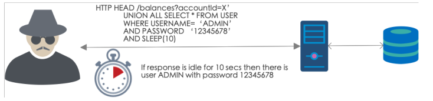\ 

**Second order Injection**

The attacker does not attack the system directly but **uses an intermediary system** to get to the primary system.

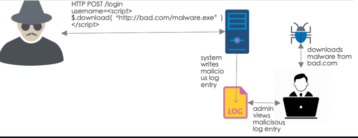\ 

**Examples**

**Simple SQL-Injection to bypass logins**

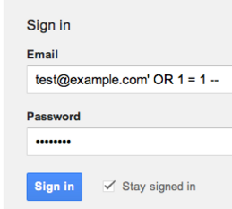\ 

By adding `'OR 1=1'` to the input, the sql statement on the backend looks like this (worst case scenario)

```` sql
SELECT username,pass FROM users WHERE username='test@example.com' OR 1 = 1 --
````

This means that either, there has to be user called 'test@example.com' or, more importantly **1 has to be equal to 1** (which is the case anyway). Additionally, the `--` in the end comments the rest of the query out, so the password is not even checked. 

**SQL-Injection using UNION**

The `UNION` keyword is perfect to extract information from a database. This is because the `UNION` operation can only be executed if **both queries have the same structure**. This means, the attacker must craft an SQL query with the same structure as the existing one and therefore gains valuable information of the database layout.

---

Existing Query: `SELECT name, description, price FROM products WHERE category=`

Crafted Query: `1 UNION SELECT 1 FROM persons`

Result: `ERROR: table or view does not exist`

---

This means, the table `information_schema.table` does not exist, so let's try another one:

---

Existing Query: `SELECT name, description, price FROM products WHERE category=`

Crafted Query: `1 UNION SELECT 1 FROM users`

Result: `ERROR: query block has incorrect number of result columns`

---

OK, so table `users` exists, but it has a different amount of columns as queried for in our existing query (`name, description, price` = 3 in our case).

---

Existing Query: `SELECT name, description, price FROM products WHERE category=`

Crafted Query: `1 ORDER BY 2`

Result: Data of the first two columns (name, price) listed, ordered by description

---

OK, can we get more?

---

Existing Query: `SELECT name, description, price FROM products WHERE category=`

Crafted Query: `1 ORDER BY 4`

Result: `ORDER BY item must be the number of a SELECT-list expression.`

---

There are too many colunns now, so we know, the existing query must ask for three elements.

Now we can start extracting data:

---

Existing Query: `SELECT name, description, price FROM products WHERE category=`

Crafted Query: `1 AND 1=2 UNION SELECT username, password, 1 FROM users`

Generated Query: `SELECT name, description, price FROM products WHERE category=1 AND 1=2 UNION SELECT username, password, 1 FROM users`

---

The `1 AND 1=2` in the beginning is to make sure that the first, original query does not return anything, so all returned results are from the second, injected query.

**LDAP Injection**

---

Existing Query: `(&(USER=username)(PASSWORD=password))`

Malicious Input: `username)&())`

Generated Query: `(& (USER=username)(&))(PASSWORD=password))`

---

The generated query has basically the same effect as the login-bypass SQL injection. the '&' makes the second half of the query unnecessary, as the first half is true anyway (the '&' crates `(&(USER=username)(TRUE))` as query)

#### Defenses

**Input**

-   Sanitise, e.g. with the HTML `strip` command to eliminate dangerous char-sequences
-   Validate, to ensure that the data is syntactically and semantically correct
-   Encode, so the data is only handled as data (e.g. URL or HTML encoding)

**Use safe APIs**

-   E.g parametrised queries for SQL, where the user-committed data never gets in direct contact with the backend-SQL code

**Reduce attack surface**

-   Disable all non standard and non-essential ffeatures, e.g. error logging as query return for SQL


<a id="orgcc68b76"></a>

### Broken Authentication

#### Terminology

-   **Subject:** The *user/entity* interacting with the system - not necessarily a person
-   **Principal:** The *identifying information* of the user
    -   Username
    -   ID
    -   LDAP DN (distinguished name)
-   **Credential:** The *proof* that the subject is who he claims to be
    -   Password
    -   Private Key
    -   Biometric
-   **Weak authentication:** Breakable withing reasonable amount of time - e.g. password based
-   **Strong authentication:** Unbreakable unless you have a few millenias at hand - e.g. certificate based or 2FA

#### Standard Web Authentication Modes

-   Standard
    -   Server expects credentials in Authorization header
    -   Server answers with WWW-Authenticate header if credentials are missing
-   Basic (WWW-Authenticate : Basic)
    -   `base64(username:password)` - Basically clear text, base64 is just an encoding
    -   Needs HTTPS because else credentials could be stolen with MITM-Attack
    -   Password can be stored in any form
-   Digest (WWW-Authenticate : Digest)
    -   `md5(username,password)` - Only send hash of credentials, not credentials as such
    -   Does not need HTTPS because no credentials are transmitted
    -   Password can only be stored in certain forms (e.g. no `bcrypt`)

**Custom login page/form**

1.  Application has its own login-page
2.  Server sends a redirect to the login-page to unauthenticated users
3.  Login page asks for credentials
4.  Server validates credentials and sets subject/role accordingly

Password gets send via cleartext (unless specified other) -> needs HTTPS

**Client certificate based**

-   Requires managing certificates/keys for every client -> complicated and expensive
-   Mostly used for machine-to-machine communication
-   Strong authentication
-   Also called 2-way-TLS or 2-way-HTTPS

#### Common Weaknesses in Authentication

-   Short sessin-ID (-> brute-force session hijack)
-   Exposure of sessin-ID (i.e. URL rewriting (`http://some-website/verysecurepage?sessionId=1111`))
-   Reuse of session-ID
-   Weak implementation of authentication algorithm
-   Weak password policy
-   Weak data protection

#### Common Attacks

-   Credential stuffing: Automated injection of leaked credentials
-   Dictionary attack: Automated injection of passwords from known usernames
-   Brute-Forcing credentials
-   XSS - Stealing credentials (e.g. keylogger)
-   Injections - Stealing credentials / Bypassing login

#### Best Practices

-   Dance like nobody's watching, encrypt like everyone is (always use HTTPS to transmit credentials)
-   Avoid using two dozen javascript frameworks - use a strict content security policy
-   Pentest
-   Have strong password policies (but not so strong that the users write the passwords on post-its)
-   Throttle too many login-attempts (e.g. fail2ban)
-   Use salted hashes with key stretching algorithm (e.g. bcrypt)
-   Long and random Session IDs
-   Change Session ID on login
-   Protect session cookies with http-only, secure, same-site attributes


<a id="org2282d96"></a>

### Sensitive Data Exposure

#### Terminology

-   **Data in transit:** Data being transported (via HTTP, FTP, SSH, Email, whatever)
-   **Data at rest:** Data being stored on a device (Server, Laptop, Mobile&#x2026;.)

#### Data being stolen

**In transit**

This is mostly by eavesdropping unencrypted communication, so use HTTPS, IPSec, VPN etc. to encrypt all traffic that contains sensitive data

**At rest**

-   Do not store your keys at the same location as your data. If your data storage gets breached, the attack only has the encrypted data but no key to decrpyt it.
    -   While decrypting data, store keys only in memory and do not serialise them.
-   Encrypt your data in the first place. Use a strong encryption algorithm for this


<a id="org43e43b8"></a>

### XML External Entities

An XML processor is instructed to **read a resource** and either **include it in the processed document** or **send it to a web service**.

There are two kinds of XML schema definitions:

-   **XSD:** XML Schame Definition
-   **DTD:** Document Type Definition

XXE only affects DTD, as it allows loading external resources with `file://` or `http://`.

#### Examples

```` xml
POST http://example.com/xml HTTP/1.1

<?xml version="1.0" encoding="ISO-8859-1"?>
<!DOCTYPE foo [
    <!ELEMENT foo ANY>
    <!ENTITY bar "World">
]>
<foo>
    Hello &bar;
</foo>
````

Will generate the following response:

````
HTTP/1.0 200 OK

Hello World
````

Alternatively, an attacker could create the following XML document:

```` xml
POST http://example.com/xml HTTP/1.1
<?xml version="1.0" encoding="ISO-8859-1"?> 
<!DOCTYPE foo [
    <!ELEMENT foo ANY>
    <!ENTITY xxe SYSTEM
    "file:///etc/passwd">
]>
<foo>
    &xxe;
</foo>
````

Which would then return the content of the webservers `/etc/passwd` file.

#### Protections

-   Disable DTD altogether
-   Disable Entities
-   Disable external Entities
-   Scan the document before executing/reading it, e.g. to scan for 'Entity' keyord


<a id="orgdb36d36"></a>

### Access Control

Access Control is a function that **controls access to specific resources**. This is usually a function whose inputs are the accessing subject and the object to be accessed and the output is the permitted access (read|write|append|execute).

#### Models

-   **DAC:** Discretionary access control - The users of the system can change the access control rules (e.g. privacy settings on social media or your own file system)
-   **MAC:** Mandatory access control - The users of the system can't change the access control rules. Only admins have this power (e.g. SE Linux)
-   **RBAC:** Role based access control - Permissions are given to roles (groups of users) instead of individual users
-   **ABAC:** Attribute based access cotrol - Permission are given based on attributes of the accessing user (what you have not who you are)
-   **Policy based:** rules are external and maintanable (e.g. Windows GPO)
-   **Open policy:** Blacklisting approach - Everything is permitted except the things that are blocked
-   **Closed policy:** Whitelisting approach: Everything is blocked except the things that are whitelisted (More secure approach)

#### Attacks

-   Bypassing access control
    -   Insecure direct object references
    -   Missing function level access control
    -   Misconfiguration
-   Elevation of privilege with metadata manipulation
    -   JWT Access Tokens
    -   Cookies, Hidden Fields (e.g. CSRF)

**Insecure Direct Object References**

Access to an object is granted or rejected based on an object ID, but the **relationship between subject and object is not checked**. 


Let's say a sales rep can access all their customers via `my.customerportal/{userID}/customers`, but they can not only check their own customers but also info of other sales reps.

Sales rep Max has userID 3, so he can check his customers via `my.customerportal/users/3/customers`. However, if he changes the URL to `my.customerportal/users/1/customers`, he can see all customers of his peer, Marcus.


Another way to trick open policy rules is to trick the policy by altering a URL. 

Only users with role `MANAGER` can access employees salaries, which are stored under `my.customerportal/managers/salaries.xhtml`. If Max tries to access it, he obviously can't because he's not a manager. But if he enters `my.customerportal/users/../managers/salaries.xhtml`, he can access the page. This beause the policy thinks he's accessing a resource under `my.customerportal/users/*`.


**Missing Function Level Access Control**

Some applications just hide unauthorised actions, e.g. the button to delete an entry is simply not displayed if you don't have the necessary privileges. However, the whole underlaying logic is still there and is still live. This means, if I don't have to rely on a button-click to execute an action but can e.g. talk to the applications API (which still contains the deletion-logic), I can still delete stuff.


<a id="orgc0200e5"></a>

### CSRF

#### Attack

CSRF misuses the trust a webpage has in the users browser.

Let's say a hacker wants to send himself money from my bank account.

He creates a fake site on a server under his control. This page has hidden html-form values, already prepopulated with data, e.g. his account-number and an amount of CHF1'000.

Meanwhile, I'm doing my monthly e-banking and am logging in onto my bank. the e-banking webpage gives me a authentication session-cookie, so I don't hae to re-login at every page-refresh. 

The attacker sends me an E-Mail with a Link to a (supposedly) safe location (Facebook or whatever), but in reality, the link connects to my e-banking webpage, **using my already existing sessino-cookie to authenticate itself as me** and executes the malicious code. In our case that would be to send himself CHF 1'000.

[Easy explanation on YouTube](https://www.youtube.com/watch?v=m0EHlfTgGUU)

#### Defense

I could **protect my session cookies with the same-site attribute**. This means that the browser does only include the session cookie if the requested site is the same site/domain that gave me the cookie. 

Alternatively, the webpage could add a **anti-CSRF token**, which is not visible to other webpages in the browser. This could be an automatically inserted `form input` field that gets sent with every request on this specific webpagej or a `meta` tag in the HTML header.

However, these methods only protect you against **other sites** trying to access your session. If an attacker manages to inject malicious code into the target site/domain, these defense-mechanisms are worthless.


<a id="orgebe8ce8"></a>

### XSS

Cross Site Sripting exploits vulnerabilities in the webapplication, so that malicious code (mostly JavaScript) can be injected. 

Similar as in CSRF, the injected code misuses the trust of the webpage in the users browser/the browsers user. Therefore, the code can run under the users principal.

The attack can do whatever the attacker managed to write in the malicious code. One example could be to overcome CSRF defenses by reading the anti-CSRF token or alternatively capture the users keystrokes with a javascript keylogger. Alternatively, he could just force the users browser to download a malware from another server.

#### Watering hole attack

Like lions preying on their prey at a water hole, an attacker preys on a user at their usual website.

1.  An atacker profiles his victim for their usual websites
2.  The attacker scans these websites for XSS vulnerabiliteis
3.  the attacker exploits vulnerable sites with Javascript code to redirect the user to a site under his control
4.  When the user visits the 'trustworthy' site, they get redirected the the site under the attackers control and shit hits the fan

#### Types

**Reflected XSS:**

I send a victim a link to `http://example.com/page?var=<script>alert('xss')</script>` and somewhere on the page that value is echoed back to the victim. The value is only on the page if they follow my special link.

**Persistent/Stored XSS:**

I find a way to get a website to persist `<script>alert('xss')</script>` for some time, maybe in the database (e.g. via SQL-Injection). Then I can send the victim to `http://example.com/page` and it reads the value out of the database and presents it to the victim.

**DOM based XSS:**

This type of XSS can be both reflected or persistent. 

It manipulates the [DOM](https://developer.mozilla.org/en-US/docs/Web/API/Document_Object_Model/Introduction) e.g. to insert malicious element. 

These elements are mostly injected/embedded in one of three sources:

*Document sink:* Updates `innerHTML` or `outerHTML` of a `document.element` with data controlled by a hacker

```` javascript
var username = searchParamas.get('name');

if(username !== null){
document.getElementById('p1').innerHTML =  'Hello, ' + username + '!';
}

/** Now what happens if the 'name' parameter is '<script>alert('xss')</script>'? **/
````

*Location sink:* Updates `document.location` with data controlled by the attacker (usually with the javascript pseude protocol, i.e. `javascript:alert('xss')`)

```` javascript
var redir = searchParams.get('redir');

if(redir != null){
document.location = redir;
}

/** Now what happens if the 'redir' parameter is 'javascript:alert('xss')' or 'http://not-a-phishing-site-i-swear.cn.ru'?**/
````

*Execution sink:* 

```` javascript
var nasdaq = 'AAA';
var dowjones = 'BBB';
var sps500 = 'CCC';

var marked = [];
var indes = searchParams.get('index').toString();

eval('market.index=' + index);

document.getElementById('p1').innerHTML = 'Current marked index is ' + marekt.index + '.';

/** If the 'index' parameter were to be 'alert('xss'), the 'eval' function will just execute it **/
````

#### Protections

-   Validate, encode and sanitise your input
-   Escape output in view (e.g. to suppress/strip all `<script> tags`)
-   Define and execute a Content-Security-Policy (From which sources should the browser trust and execute)

<table border="2" cellspacing="0" cellpadding="6" rules="groups" frame="hsides">


<colgroup>
<col  class="org-left" />

<col  class="org-left" />
</colgroup>
<thead>
<tr>
<th scope="col" class="org-left">CSRF</th>
<th scope="col" class="org-left">XSS</th>
</tr>
</thead>

<tbody>
<tr>
<td class="org-left">Misuses trust of the page</td>
<td class="org-left">Misuses trust of the user</td>
</tr>


<tr>
<td class="org-left">Application is not necessarily vulnerable (just needs CSRF protection)</td>
<td class="org-left">Application is vulnerable, as it lets JS code be injected</td>
</tr>


<tr>
<td class="org-left">More of a browser/client cookie-handling issue</td>
<td class="org-left">Attacks both server- and client-side vulnerabilities</td>
</tr>


<tr>
<td class="org-left">Needs Application protections</td>
<td class="org-left">Plentiful techniques which continuously evolve</td>
</tr>


<tr>
<td class="org-left">&#xa0;</td>
<td class="org-left">-> Reevaluate your mitigations often</td>
</tr>
</tbody>
</table>


<a id="org8dd0dda"></a>

### Insecure Deserialisation

-   **Serialisation:** Savig an objects state from memory into a data representation (also called marshalling), may that be binary or text form
-   **Deserialisation:** Restoring an objects state into memeory from the serialised representation (also called unmarshalling)
    -   Mostly used for data transfer, like RPC

Let's say an attacker writes a malicious script (example in python, executes the `whoami` command) and serialises it, sending a simple String to the webapp.

```` python
class Exploit(object)
def __reduce__(self)
return (os.system, ('whoami',))

def serialise_exploit()
shellcode = serialise(Exploit())
return shellcode
````

The webapp now deserialises this, seemingly trusted, serialised object

```` python
def insecure_deserialisation(code)
deserialise(code)
````

This will deserialise the data and run the `whoami` command.

To prevent this, obvious coutnermeasures would of course be to **disable Serialisation and Deserialisation** and all functionalities relying on it, like RMI or JMX. 

If you *have* to use it, at least **isolate deserialising code** and limit its privilges (e.g in a VM or with SELinux). Also verify the integrity and authenticity of the deserialised objects before storing them.


<a id="orge4ad157"></a>

### Using Components With Known Vulnerabilities

It is very common for web services to include a component with a known security vulnerability. When that happens it falls under this category, independently of what kind of component is vulnerable, making this a very frequent finding.

The component with a known vulnerability could be the operating system itself, the CMS used, the web server, some plugin installed or even a library used by one of these plugins.

#### Protection

-   Regulaerly update/patch your software
-   Ensure a fast deployment process
    -   Speed and level of automatin of build -> test -> deploy process
-   Integrate Scanning for vulnerabilities in your deplyoment routine
    -   Use a package management system like pip, maven, npm


<a id="org5927f96"></a>

## Authentication/Authorisation


<a id="org4c4ff4f"></a>

### SAML

SAML stands for **Secuirty Assertion Markup Language** and is used to exchange security information. It is mostly used for Single-Sign-On

SAML has three main **roles**:

-   Subject/Principal
-   Asserting Party
-   Relying Party

SAML also has three main **building blocks**:

-   *SAML Assertions:* Statements about the subject
    -   Authentication statement
    -   Attribute statement
-   *SAML Protocol or queries:* Means of acquiring a statment
    -   Authentication query
    -   Attribute query
    -   Artifact Resolution Protocol
-   *SAML Bindings:*
    -   HTTP Redirect Bindings
    -   HTTP Post binding
    -   SOAP Binding

SAML **profiles** are a combinatino of *Assertions + Protocols + Bindings* e.g.

-   Web browser SSO
-   Artifact resolution
-   Identity Provider Discovery Profile
-   Name Identifier Mapping Profile

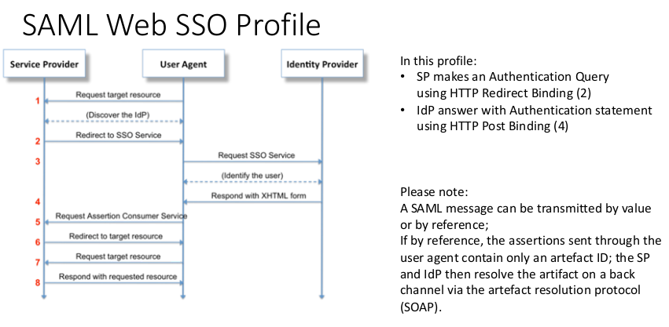\ 

#### Threats

-   Spoofing the identity of the subject at the service provider and/or elevate privilege
-   Exploit SAML vulnerabilities
    -   SAML based on XML -> XXE

#### Best Practices

-   **Message Expiration:** SAML messages should contain a timestamp and expiration date. This prevents 'recycling' or older SAML messages for e.g. privilege escalation
-   **Message Uniqueness:** SAML messages should have an UID, which is only accepted once. This is also to combat the aforementioned messge-recycling
-   **Recipent Validation:** Service Provider should check if the message was actually intended for it. This is to prevent replaying messages from other SP
-   **Signature Validation:** Ensure that all assertions are signed by a real Certificate Authority to prevent an attacker tampering with it


<a id="orgc96441c"></a>

### Security Tokens

Tokens present an easy way to stay signed in across a network. You sign on once and get a token. This is your 'ticket' to all other services in the network. If you want to login to a service, you simply present your ticket as proof of your identity.

Tokens are usually time and network restricted. Meaning I can't take my token to antoher network and I can only use it for a fixed amount of time
Tokens present an easy way to stay signed in across a network. You sign on once and get a token. This is your 'ticket' to all other services in the network. If you want to login to a service, you simply present your ticket as proof of your identity.

Tokens are usually time and network restricted. Meaning I can't take my token to antoher network and I can only use it for a fixed duration.

#### Token Types

-   **Opaque:** The token in itself does not have any meaning to the client. Only the party who issued the token can understand it
-   **Bearer:** Whoever is in possession of the token may use it
-   **Self encoding:** The token contains all relevant information in itself

Bearer tokens are always opaque, whereas self encoding tokens can but do not have to be.


<a id="org9d7ba7e"></a>

### OAuth

As the owner of resource *R* in application *X*, I allow application *Y* to access *R* without giving it my credentials to *X*. Basically a kind of SSO.

I can e.g. allow LinkedIn to access my Gmail address book to lookf or potential connections:

1.  I login to LinkedIn and click on *Gmail sync*
2.  Linked in presents me with a Google login-prompt (authorisation request)
3.  Google logs me in and asks me if I want to give LinkedIn access to my Gmail-contacts
4.  After confirming, Google redirects me to LinkedIn. LinkedIn now has an *authorisatin code* to login to my Google account

LinkedIn does have neither my Google credentials nor does it have full access to my google account (e.g. Google Drive).

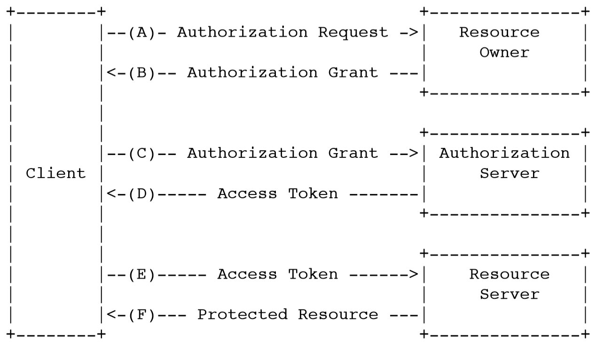\ 

#### Roles

-   **Resource owner:** Usually end user (or client app) - Me
-   **Client:** Application that wants to access the resource - LinkedIn
-   **Resource server:** Server managing the resource - Gmail Server
-   **Authorisation server:** Server managing authorization decisions - Google auth server

#### Tokens

-   **Access token:** Sent by client to the resource server to authorise access to the resource
-   **Refresh token:** Sent by client to the authorisation server to obtain a new access token.
-   **ID token (used by OpenID connect):** Sent by authorisation server to the client as self-encoded token holding assertions about the resource owner

#### Flows

**Authorisation Code Flow**

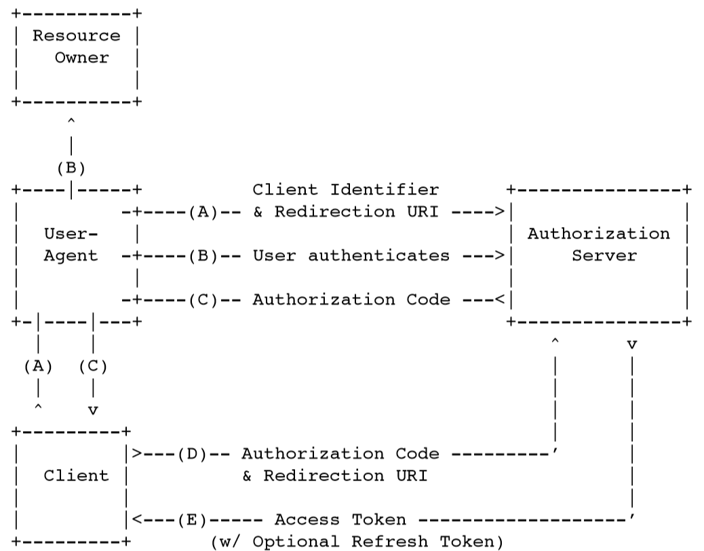\ 

**Implicit Flow**

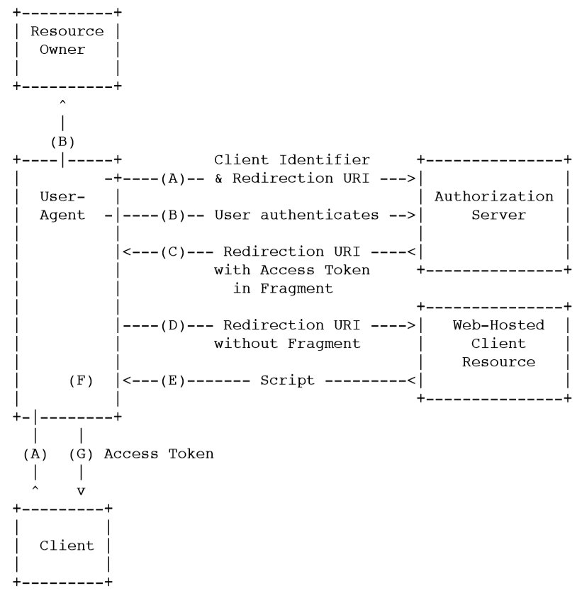\ 

**Resource owner Password Credentials Flow**

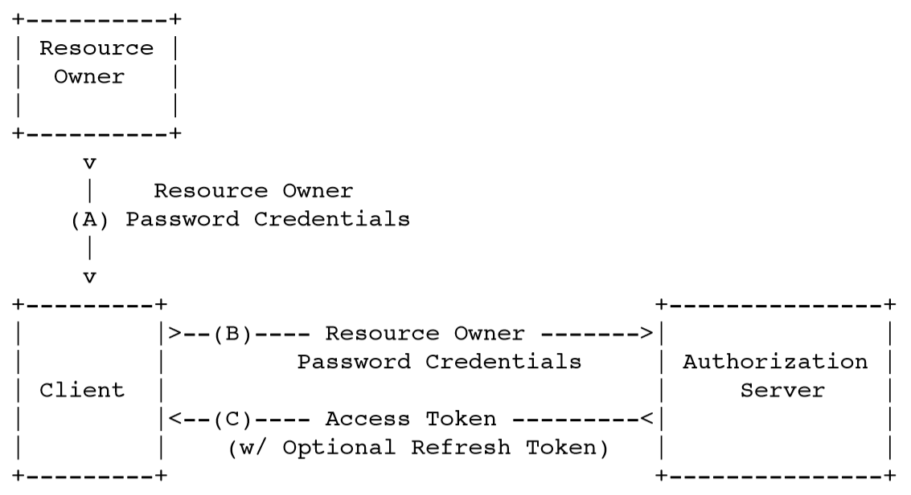\ 

#### Threats

-   Redirect-URL manipulation
    -   Atacker makes authorization server to redirect to antoher page and steals the authorizatiuon grant (or access token)
-   XSS (Against Implicit flow
    -   Attacker stals access token used in an implicit flow
-   Phishing
-   Click-Jacking
    -   Trick user into granting access with hidden iFrame

#### Protection

-   Ensure authorisation server ony stores valid redirect URLs
-   Use authorisation code flow with PKCE (proof key for code exchange)
-   Avoid using implicit flow)
-   Try to not be a stupid user


<a id="org74c358e"></a>

## Untrusted Input


<a id="org6f07199"></a>

### Validation

Valid input

-   Originates from a legitimate system/user
-   Is of reasonalbe size
-   Lexically correct (contains only the supported characters/tokens)
-   Has the correct syntax (is in the correct format, complies with the given schema)
-   Semantically correct (is meaningful in the given setting, i.e. there is such an account when entering transactions)

How to validate input:

1.  **Check origin** if it's from a trusted user / fro ma trustworthy source address
    1.  Also works e.g. with a firewall that automatically blocks blackslisted IPs
2.  **Check size:** Is the data of reasonable length?
3.  **Check lexicality:** Does the data contain any non-standard characters?
4.  **Check syntax:** Is the data in the correct format (JSON, XML, whatever)
5.  **Check semantics**

This chronology uses as little resources for bogus data as possible


<a id="org4d16f81"></a>

### Encoding/Escaping/Sanitisation

-   **Encoding:** Process of converting data from one form to another.
    -   Character encoding (UTF-8, UTF-16)
    -   Base64 as binary-representation in ASCII
    -   HTML encoding to convert HTML control chars to entity references (`<strong>bold text</strong>`)
-   **Escaping:** Subset of Encoding
    -   Replace or prefix certain 'special' characters (e.g. turn 'My folder' into 'My\\ folder').
-   **Sanitisation:** Remove potentially dangerous characters
    -   Remove `<script>` tags (or all kinds of tags)

With good validation rules in place, encoding and sanitisation **should** not even be necessary anymore, but we all know that this is only wishful thinking. However, proper encoding, escaping and sanitisation does signifcantly reduce the rist ok injections and/or XSS attacks. 

On the other hand, you should not go overboard with the sanitisation or else you'll butcher your users' input. E.g a rich text input-field should not have all HTML tags removed, as that defies the whole thing of rich text.


<a id="org3d7f0d9"></a>

## Security Principles


<a id="orgb0d4001"></a>

### Minimum Exposure

-   Harden your system
    -   Deploy/Install only the necessary components and libraries, because even if you don't use them *at the moment*, they can still be exploited
-   Expose onty the necessary functionality
    -   Do not expose unused operations
    -   Remove obsolete functionality
    -   Use interfaces that only provide the necessary funtionality


<a id="org870503b"></a>

### Simplicity

Higher complexity leads to a higher number of vulnerabilities and an increased attack surface. Therefore, **the simpler a system, the smaller its attack surface**. 

Additionally, the simpler a system is, the easier it is to reason about and prove its correctness


<a id="orgfa9604e"></a>

### Defense in depth

-   Install multiple control mechanisms to prevent threats because
    -   Single point of failure - A singe mechanism might fuck up or break
    -   Single point of security - A single control mechanism is far easier to circumvent

**Redundancy is key**


<a id="org4ba22c7"></a>

### Least privilege

-   Grant privileges on a **need-to-know** base: Only grant privileges where vital for the execution of their tasks
-   Let processes run on the lowest possible privileges. That way, if shit hits the fan and they go rogue, not much can happen


<a id="orgb587e7d"></a>

### Compartmentalisation

-   Segment the system/application components according to
    -   Functionality and subdomains
    -   Security properties
-   Contain potentially malicious activities within boundaries


<a id="orgde8a8df"></a>

### Minimum trust and maximum trustworthiness

-   Trust external systems as little as possible
    -   Validate, encode and sanitise supplied data
    -   Do not count on them being available at all times - Design for their failure
-   Make your system as trustworthy as possible towards other systems
    -   Supply trustworthy data
    -   Provide maximum avialability


<a id="org189998e"></a>

### Traceability and mediation

-   Log all requests as well as remote and local system calls across trust boundaries. This helps identify
    -   Security breaches
    -   Attack patterns
    -   Traffic/Behaviour anomalies
-   Additionally, this helps to intervene when a possible attack has been spotted


<a id="orgac04fc2"></a>

## Security through Typing

A **data type** is a **classification** of data that **defines** the **meaning**, the **operation** and **possible values** of said data.

The type system is a set of rules, that assigns and enforces types to elements of a program (except JavaScript, JavaScript does not give a fuck)

Type checking ensures that the rules of the type system are respected by the progra. It is doen b the type checker at either compile or run time (Java vs. Python)


<a id="org8c564f7"></a>

### Classification of Typing

-   **Dynamic** typing does not do type checking at compile time
-   **Static** typing does do type checking at compile time
-   **Weak** typed systems implicitly convert values from their actual to the expected type
-   **Strong** typed systems throw an error and require explicit conversions

Languages are usually **dynamic weak** or **strong static** typed. (See Javascript vs. Java)

Dynamic weak typing is also sometimes referred to as **duck typing** *if it looks like a duck, quacks like duck and walks like a duck, it must be a duck*.


<a id="orgf2184f3"></a>

### Typing and Security

-   Strong typing drastically reduces rist of injections
    -   The 'string' class does some validation, espacing and sanitising by itself already, e.g. would `‘ UNION SELECT USERNAME, PASSWORD FROM USERS where ROLE = ‘ADMIN’ --` not ba a valid string, except if it was escaped.
    -   Custom data types with strict contraints can also prevent malicious input being accepted and passed to the backend
    -   Validation through custom data types can guarantee the data is valid throughout its whole lifecycle


<a id="org24730eb"></a>

## OWASP and STRIDE

-   Spoofing
    -   Injection
        -   `' AND 1=1 --` as login input
        -   Steal creentials through SQL injection
    -   Broken Authentication
        -   e.g. brute-forces login
    -   XSS
        -   Steal session ID
-   Tampering
    -   CSRF
        -   Create malicious transaction
    -   XSS
        -   Create malicious transaction
    -   Injection
        -   Inject an `UPDATE` or `DELETE` statement
-   Repudiation
    -   Insufficient Logging and Monitoring
        -   No logs to prove the action
-   Information Disclosure
    -   Sensitie Data Exposure
        -   Data not sufficiently protected
    -   Injection
        -   `UMION` or `BIND` SQL injection
    -   XSS
        -   Steal data e.g. via keylogger
-   Denial of Service
    -   Insufficient Logging and Monitoring
        -   No monitoring, so no alarm when traffic suddenly increases
    -   XSS
        -   Malicious Payload crashes the system
-   Escalation of Privilege
    -   Broken Access Control
        -   Bypass e.g. due to direct object references
    -   XXE
        -   Access HTTP resources behind a firewall
    -   Insecure Deserialsation
        -   Bypass authorisation if it relies on data serialised insecurely

