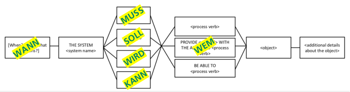
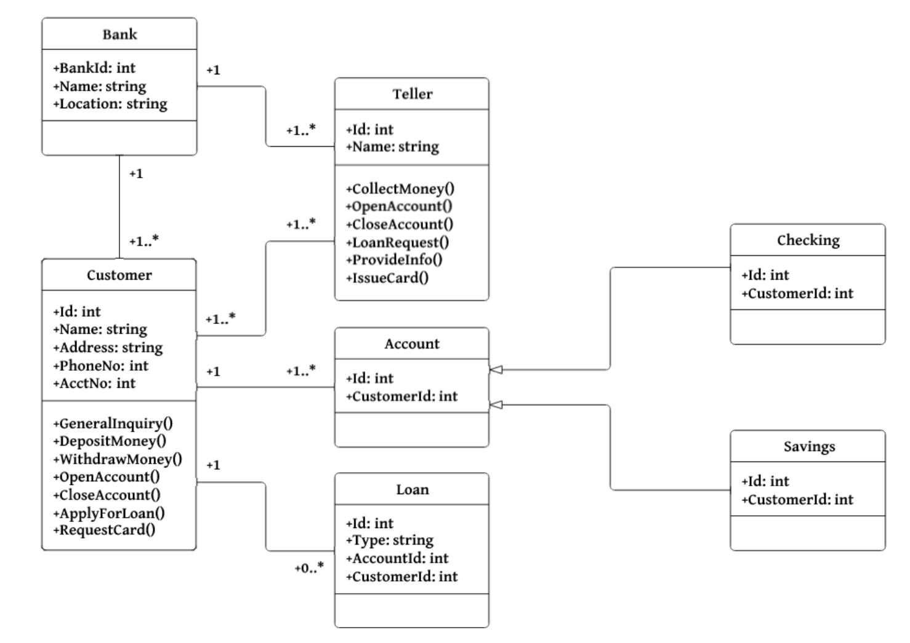
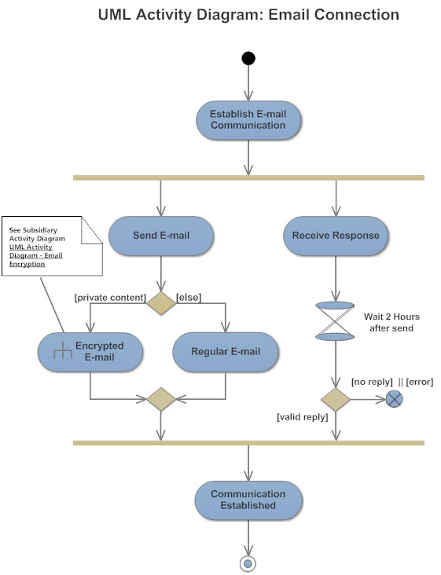
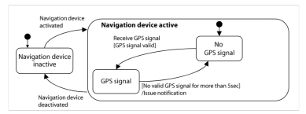

# Table of Contents

1.  [Repetitionsfragen](#orge3a81cc)
    1.  [Woche 1](#org24a1a99)
        1.  [Was ist der Unterschied zwischen funktionalen-und nichtfunktionalen Anforderungen?](#orgb41048f)
        2.  [Was ist ein Requirement genau?](#org9dccc65)
        3.  [Definieren Sie den Requirement Engineer (RE) / Business Analyst(BA)](#org52621a4)
        4.  [Was sind die 4 Kernpunkte/Aktivitäten im RE?](#orga9ad457)
        5.  [Nennen Sie mindestens 4 Methoden um Requirements zu finden](#orgaf88f6c)
        6.  [Wie können Requirements definiert und beschreiben werden?](#org7f14b58)
        7.  [Formulieren Sie 3 offene und 3 geschlossene Fragen](#org7dd6759)
        8.  [Was ist ein Stakeholder (Definitionund mögliche Beispiele)](#org8b0b813)
        9.  [Warum ist ein Programmierer ggf. nicht geeignet für Security RE?](#org601cda7)
        10. [Was sind die Gefahren, wenn man RE nicht korrekt einplant und durchführt?](#org01a13d9)
        11. [Was kann man tun / vorgehen, wenn man unter Zeitdruck steht beim RE?](#org20ea6bf)
        12. [Zeigen Sie ein System mit Systemgrenzen und Kontext auf](#org2214c0c)
    2.  [Woche 2](#org16fa91d)
        1.  [Nennen Sie die 3 Perspektiven in/von welchen man Requirements betrachten kann](#orgc0d6a2c)
        2.  [Wie kann man Requirements Beschreiben bzw. Dokumentieren?](#orgc7196f8)
        3.  [Nennen Sie die Elemente eines Datenflow Diagramms (DFD)](#orgc2c2b7d)
        4.  [Nennen Sie einige Qualitätskriterien von Requirements](#orga6b40d4)
        5.  [Warum ist ein Glossar wichtig?](#org0dcbd4d)
        6.  [Was gibt es für Standards zur Dokumentation von Requirements, nennen Sie 3](#org3a2237a)
        7.  [Was ist der Unterschied zwischen Security & Safety?](#org4270aec)
        8.  [Was versteht man unter «Defense in depth» Ansatz?](#org4d70bed)
        9.  [Was versteht man unter Perimeter Sicherheit?](#org6001bd3)
        10. [Warum ist Perimeter Sicherheit nicht mehr unbedingt das Grundkonzept für die Sicherheit von Modernen Systemen/IT-Landschaften und was sind die aktuellen Challenges?](#orgffdd021)
        11. [Was ist eine Vulnerability?](#org4f3cabb)
        12. [Was ist ein Exploit?](#org8ae0818)
        13. [Wie wird eine Vulnerability ausgenützt, beschreiben Sie das Vorgehen](#org4b3227c)
        14. [Was ist Malware und wie läuft eine Infektion ab?](#org4a21b1a)
    3.  [Woche 3](#org6af7c12)
        1.  [Wie ist das Verhältnis von Kosten und Bugs bzw. Zeitpunkt deren Erkennung im Projekt. Wie können Sie dies nutzen für die Argumentation von Security Requirement Engineering im Projekt?](#orge37b51c)
        2.  [Was ist ein SW Bug?](#orgc07dbbf)
        3.  [Warum macht man Threat modeling?](#org860e1da)
        4.  [Was gibt es für rechtliche Anforderungen, die man ggf. beachten sollte?](#org31510c9)
        5.  [Was ist der Vorteil und Nachteil von einem Wasserfall Model?](#org4a8474c)
        6.  [Machen Sie ein Beispiel in einer Tabelle für eine Vulnerability und deren Auswirkung analog unserem Bsp. im Unterricht (Vulnerability, Threat, Threat Action, Risk)](#org950078b)
        7.  [Was sind mögliche Quellen von Bugs?](#orgac6ca76)
        8.  [Was sind die verschiedenen Activities in einem SW Prozess, nennen Sie diese](#orge1735d1)
        9.  [Was ist ein Prozess Model? Nennen Sie 4 Beispiele](#orge92c39e)
        10. [Nenne Sie Qualität Attribute in der Software quality assurance](#org06de45c)
        11. [Was ist das agile Manifest, was wird darin festgehalten?](#org20da583)
        12. [Was ist devops und was für einen Impact hat dies auf das Security Requirement Engineering?](#org1419db4)
        13. [Was sind die Grundschritte beim SDLC, in welche Schritte beim SDLC kann man Security integrieren?](#org81f979c)
        14. [Was gibt es für Standard Kataloge bzgl. Security Requirements](#org7ff1243)
        15. [Was ist OWASP, wie kann man OWASP für Security Requirement engineering nutzen?](#orgd840498)
        16. [Was ist ein Threat? Was ist eine Vulnerability? Was ist der Unterschied?](#org3097b36)
        17. [Was sind die Schritte beim Threat Modeling?](#orgb82aaa5)
        18. [Nennen Sie Beispiele für SW Qualität](#orgd41c86a)
        19. [Machen Sie ein korrektes Beispiel eines DFDs inklusive Legende](#org1ea47b5)
        20. [Was ist der Vorteil und Nachteil von einem Agilen Model? Was ist das Kernkonzept der agilen Vorgehensweise?](#org4782b44)
    4.  [Woche 4](#org86bf2ee)
        1.  [Nennen Sie für jeden Threat im STRIDE Model eine Mitigation Massnahme](#orgf9d3194)
        2.  [Wie können AI und ML Threats und das Verhalten von Angreiffern beeinflussen?](#orge6976bf)
        3.  [Was bedeutet STRIDE?](#org495b2fa)
        4.  [Was bedeutet DREAD](#org7877d5c)
        5.  [Was gibt es für Modelle, um das Riskrating vorzunehmen mit DREAD?](#org25923da)
        6.  [Was für mögliche Rahmenwerke können Ihnen helfen, um Threats zu identifizieren?](#org8a9e0c8)
        7.  [Was ist unter Mitigation zu verstehen?](#org6227ee3)
        8.  [Was ist in der heutigen Zeit (Entwicklung der aktuellen IT-Landschaft) die Herausforderung mit STRIDE?](#org45faab6)
        9.  [Beschreiben Sie die 4 Schritte des Threat Modeling Prozesses](#orgc1fa61e)
    5.  [Woche 5](#org70f46cd)

# Repetitionsfragen

## Woche 1

### Was ist der Unterschied zwischen funktionalen-und nichtfunktionalen Anforderungen?

1.  3 Beispiele für funktionale Anforderungen

    -   Die Maschine muss Kaffee rauslassen können
    -   Der Kaffee muss mit Bargeld oder Karte bezahlt werden können
    -   Es muss ein Nachfüllmechanismus vorhanden sein

2.  3 Beispiele für nichtfunktionale Anforderungen

    -   Es müssen mehrere Arten von Kaffee zur Verfügung stehen
    -   Das UI muss ein touchscreen sein
    -   Es müssen 10'000 Kaffees rausgelassen werden können bevor die Maschine nachgefüllt werden muss

### Was ist ein Requirement genau?

Eine Bedingung oder Fähigkeit des Produktes, die ein user benötigt, zu, ein gestelltes Problem zu lösen

### Definieren Sie den Requirement Engineer (RE) / Business Analyst(BA)

1.  Was ist die Rolle eines RE in einem Projekt?

    Der RE ist die Schnittstelle zwischen der technischen Seite des Projektes (den Programmierern) und dem Management. Er kann zwischen diesen beiden Seiten 'übersetzen'

2.  In welchen Phasen ist der RE involviert?

    In allen Phasen
    
    1.  Requirement Analyse
    
        -   Stakeholder-Analyse
        -   DokumentenAnalyse
        -   Erhebung der Anforderungen
        -   Workshops / Interviews mit Stakeholder
        -   Business und User-Requirement Analyse
        -   Auflistung und Priorisierung der Use-Cases
    
    2.  Design
    
        -   Detaillierte Spezifikationen von Business-Problemen, Aktoren, Use-Cases und Interfaces
        -   GUI Design
        -   Review der Spezifikationen
        -   Abnahme der Spezifikationen
    
    3.  Implementation
    
        -   Walkthrough der Spezifikationen mit Technical Project Lead (TPL) und Devs
        -   Support der Devs
        -   Klärung von allfälligen neuen Punkten mit den Business Stakeholdern
        -   Change Management
    
    4.  Testing
    
        -   Test Support
        -   Klärung von allfälligen Defekten
        -   Klärungen von allfälligen neuen Issues
        -   Change Management
    
    5.  Evolution
    
        -   Analyse der Change Requests
        -   "Aufräumen" der Dokumentation

### Was sind die 4 Kernpunkte/Aktivitäten im RE?

1.  Elicitation

    Während der Erhebung der Requirements werden verschiedene Techniken verwenden, um Requirements von Stakeholdern (und allfälligen anderen Quellen) zu erhalten und zu verbessern

2.  Documentation

    In der Dokumentationsphase werden die erhobenen Requirements genauer beschrieben. Auch hier werden verschiedene Technologien verwendet.

3.  Validation and Negotiation

    Um sicherzustellen, dass die erhobenen Requirements den Ansprüchen der Stakeholder genügen, müssen sie schon früh validiert und allenfalls tiefer verhandelt werden

4.  Management

    Requirement Management wird in allen bisher genannten Aktivitäten benötigt und beinhaltet alle benötigten Massnahmen um die erhobenen Requirements zu strukturieren. Das heisst, sie so zu verarbeiten,
    dass die Devs ein Produkt/eine Software danach entwickeln können, das Management sie aber trotzdem noch versteht. Ebenfalls muss eine Konsistenz geschaffen werden.

### Nennen Sie mindestens 4 Methoden um Requirements zu finden

1.  Dokumentations-Analyse
2.  Interviews mit Stakeholdern
3.  Workshops
4.  Questionnaires
5.  Brainstorming

1.  Welche davon sind Kreativ Methoden?

    Kreativ-Methoden dienen dazu, ****innovative**** Requirements zu finden.

### Wie können Requirements definiert und beschreiben werden?

1.  Beispiele für ein statisches und agiles Vorgehen?

    1.  Statisch
    
        Wasserfall-Modell
        
        -   Alle Requirements werden bereits zu Beginn erhoben, verfeinert und dokumentiert und sollten sich im Verlauf des Projektes möglichst nicht ändern.
    
    2.  Agil
    
        SCRUM/Sprint-Basiert:
        
        -   Requirements werden 'on the go' erhoben. Erst bevor sie implementiert werden, werden die Requirements als 'Features' definiert. Dies, da es schwer ist, alle benötigten Funktionalitäten bereits zu
        
        Begiunn eines Projektes zu definieren, weil sich während der Laufzeit des Projektes noch viel verändernk kann.

### Formulieren Sie 3 offene und 3 geschlossene Fragen

**Offene Fragen**

-   Wieso bist du hier?
-   Was sind deine Hobbies?
-   Welche Security-Lücken müssen geschlossen werden?

**Geschlossene Fragen**

-   Sind die besprochenen Security-Lücken bereits geschlossen worden?
-   Liegen wir noch im Zeitplan?
-   Habt ihr schon mit den Stakeholder gesprochen?

### Was ist ein Stakeholder (Definitionund mögliche Beispiele)

Eine Person, die am Produkt interessiert ist (Entweder Endnutzer oder Distributor oder Hersteller&#x2026;)

1.  Zeichnen Sie eine Stakeholderliste anhanden des Kaffeemaschine Cases

    -   Kaffee-Hersteller
    -   Betreiber von Kaffeemaschinen
    -   Universitäts/Hochschulsbetreiber
    -   Kaffeetrinker
    
    &#x2026;.

### Warum ist ein Programmierer ggf. nicht geeignet für Security RE?

Er hat nicht das nötige Know-How und ggf. auch nicht die Zeit. Zduem ist er 'zu nah' am Produkt (Creator-Blindness)

### Was sind die Gefahren, wenn man RE nicht korrekt einplant und durchführt?

Es kommt wesentlich teurer, die Fehler bei/nach der Implementierung zu flicken, da viele Dinge voneinander abhängen

### Was kann man tun / vorgehen, wenn man unter Zeitdruck steht beim RE?

Risikobasiertes Priorisieren und von oben anfangen (Requirement mit dem höchsten Risiko) und so weit arbeiten wie man kommt

### Zeigen Sie ein System mit Systemgrenzen und Kontext auf

1.  Machen Sie ein simples Beispiel dazu um dies zu erklären(Bsp. Kaffeemaschine)

    

## Woche 2

### Nennen Sie die 3 Perspektiven in/von welchen man Requirements betrachten kann

1.  Datenperspektive

    Welches **Format** bzw. welche **Struktur** haben die **Daten**, die in das **System hereingegeben** werden und welches Format bzw. Struktur haben die **retournierten Daten**?

2.  Funktionale Perspektive

    Welche Informationen (Daten) werden vom System empfangen und von dessen Methoden/Funktionen verarbeitet. Diese Dokumentationsmethode beschreibt ebenfalls, welche Daten wieder zurückgegeben werden. Ebenfalls wichtigt ist es zu dokumentieren, **in welcher Reihenfolge** die Funktionen/Methoden die empfangenen Daten verarbeiten.

3.  Verhaltensperspektive

    Diese Methode beschreibt wie das System mit dem umliegenden **Kontext interagiert**. Das heisst, wie **reagiert** das System auf bestimmte **Events vom umliegenden Kontext** und welche **Konditionen** müssen gegeben sein, dass es so reagiert. Ebenfalls wird dokumentiert, wie das System den umliegenden Kontext beeinflusst (z.B. einen Trigger auslöst, der ein weiteren Prozess in einem anderen System ankickt)
    
    Dies wird meist mittels State-Diagrammen dargestellt.

### Wie kann man Requirements Beschreiben bzw. Dokumentieren?

1.  Natural Language

    Beschreibt das System in natürlicher Sprache, evtl. mit Templates.
    > Das System **WIRD/MUSS/KANN/SOLLTE** **TASK** tun können
    
    > Das System **<WIRD/MUSS/KANN/SOLLTE>** **<USER/ROLLE>** **<TASK>** ermöglichen 
    

2.  Modelle

    Alternativ können Modelle und Diagramme verwendet werden. Das hat den Vorteil, dass die Requirements klarer dargestellt sind und weniger Raum für Spekulationen bietet. Jedoch muss der Betrachter ein grundsätzliches Verständnis des Modells/Diagramms haben
    
    1.  Usecase Diagramm
    
        Welche Funktionen werden welchem Benutzer/welcher Rolle des Systems zur Verfügung gestellt
        
    
    2.  Klassendiagramm
    
        Gut geeignet, um Datenstrukturen zu dokumentieren. Welche Klassen/Interfaces verlangen welche Datentypen als Input and retournieren welche Datentypen? Ebenfalls zeigt ein solches Diagramm die Zusammenhänge und Abhängigkeiten von Komponenten.
        
        
    
    3.  Aktivitätsdiagramm
    
        Gut geeignet, um Prozessabläufe zu dokumentieren. Welche Tasks werden nacheinander durchgeführt? Welche Bedingungen müssen erfüllt sein?
        
    
    4.  Statusdiagramm
    
        Gut geeignet, um die Verhaltensperspektive zu dokumentieren. Statusdiagramme zeigen die verschiedenen Stati des Systems auf, welche Events einen Statuswechsel auslösen und wie sich diese Stati auf den Systemkontext auswirken
        

### Nennen Sie die Elemente eines Datenflow Diagramms (DFD)

### Nennen Sie einige Qualitätskriterien von Requirements

### Warum ist ein Glossar wichtig?

### Was gibt es für Standards zur Dokumentation von Requirements, nennen Sie 3

### Was ist der Unterschied zwischen Security & Safety?

### Was versteht man unter «Defense in depth» Ansatz?

### Was versteht man unter Perimeter Sicherheit?

### Warum ist Perimeter Sicherheit nicht mehr unbedingt das Grundkonzept für die Sicherheit von Modernen Systemen/IT-Landschaften und was sind die aktuellen Challenges?

### Was ist eine Vulnerability?

### Was ist ein Exploit?

### Wie wird eine Vulnerability ausgenützt, beschreiben Sie das Vorgehen

### Was ist Malware und wie läuft eine Infektion ab?

## Woche 3

### Wie ist das Verhältnis von Kosten und Bugs bzw. Zeitpunkt deren Erkennung im Projekt. Wie können Sie dies nutzen für die Argumentation von Security Requirement Engineering im Projekt?

### Was ist ein SW Bug?

### Warum macht man Threat modeling?

### Was gibt es für rechtliche Anforderungen, die man ggf. beachten sollte?

### Was ist der Vorteil und Nachteil von einem Wasserfall Model?

### Machen Sie ein Beispiel in einer Tabelle für eine Vulnerability und deren Auswirkung analog unserem Bsp. im Unterricht (Vulnerability, Threat, Threat Action, Risk)

### Was sind mögliche Quellen von Bugs?

### Was sind die verschiedenen Activities in einem SW Prozess, nennen Sie diese

### Was ist ein Prozess Model? Nennen Sie 4 Beispiele

### Nenne Sie Qualität Attribute in der Software quality assurance

### Was ist das agile Manifest, was wird darin festgehalten?

### Was ist devops und was für einen Impact hat dies auf das Security Requirement Engineering?

### Was sind die Grundschritte beim SDLC, in welche Schritte beim SDLC kann man Security integrieren?

### Was gibt es für Standard Kataloge bzgl. Security Requirements

### Was ist OWASP, wie kann man OWASP für Security Requirement engineering nutzen?

### Was ist ein Threat? Was ist eine Vulnerability? Was ist der Unterschied?

### Was sind die Schritte beim Threat Modeling?

### Nennen Sie Beispiele für SW Qualität

### Machen Sie ein korrektes Beispiel eines DFDs inklusive Legende

### Was ist der Vorteil und Nachteil von einem Agilen Model? Was ist das Kernkonzept der agilen Vorgehensweise?

## Woche 4

### Nennen Sie für jeden Threat im STRIDE Model eine Mitigation Massnahme

-   **Spoofing**: 2FA
-   **Tampering**: Checksum
-   **Repudiation**: Server- und Clientseitiges Logging
-   **Information Disclosure**: Encryption
-   **Denial of Service**: Loadbalancer
-   **Elevation of Privilege**: Strong authorization

### Wie können AI und ML Threats und das Verhalten von Angreiffern beeinflussen?

-   AI: Behaviour erkennen und Gegenmassnahmen einleiten
-   

### Was bedeutet STRIDE?

-   Spoofing
-   Tampering
-   Repudiation
-   Information Disclosure
-   Denial of Service
-   Elevation of Privilege

1.  Geben Sie zu jedem Threat das dazugehörige Property an

    -   Authentication
    -   Iintegrity
    -   Nonrepudiation
    -   Confidentiality
    -   Availability
    -   Authorization
    
    TODO: Beispiele machen

### Was bedeutet DREAD

-   Damage
-   Reproducability
-   Exploitability
-   Affected Users
-   Discoverability

1.  Beschreiben Sie jede Kategorie kurz

    -   Damage: Wie viel Schaden richtet die Vulnerability an falls sie exploitet wird
    -   Reproducability: Wie einfach ist es, die Vulnerabillity zu reproduziere
    -   Exploitbility: Wie einfach ist es, diese Vulnerability zu exploiten
    -   Affected Users: Wie viele User sind betroffen, sollte die Vulnerability exploitet wrden

### Was gibt es für Modelle, um das Riskrating vorzunehmen mit DREAD?

### Was für mögliche Rahmenwerke können Ihnen helfen, um Threats zu identifizieren?

1.  Nennen Sie 3

### Was ist unter Mitigation zu verstehen?

### Was ist in der heutigen Zeit (Entwicklung der aktuellen IT-Landschaft) die Herausforderung mit STRIDE?

### Beschreiben Sie die 4 Schritte des Threat Modeling Prozesses

## Woche 5

